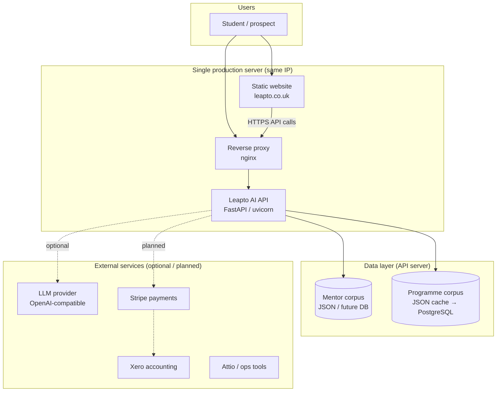
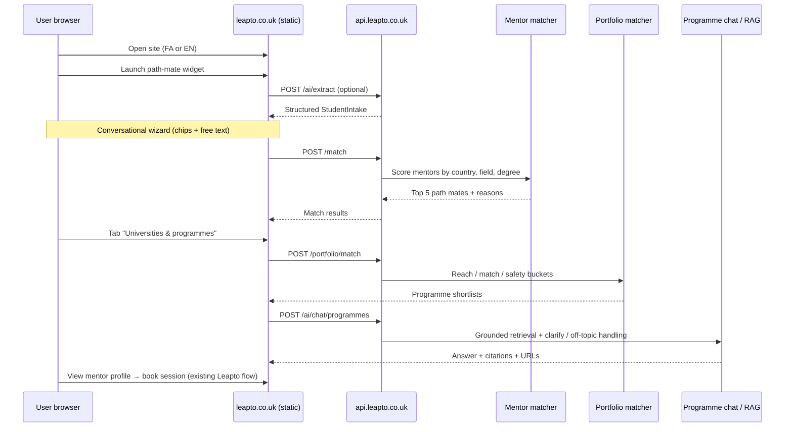
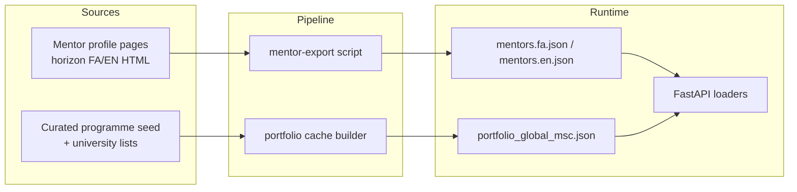
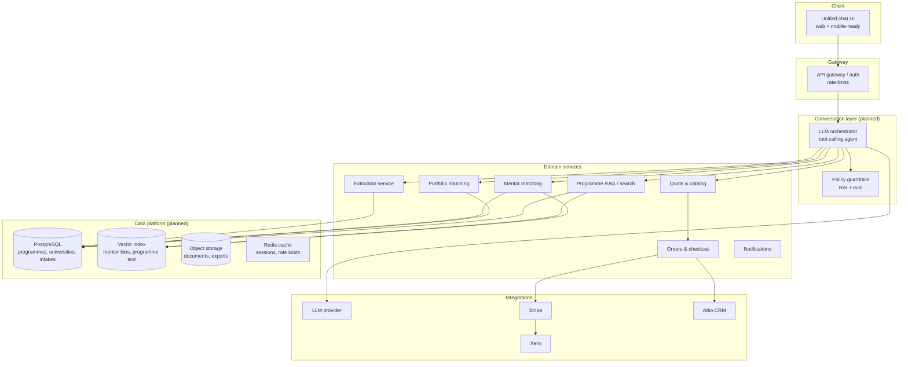

# Leapto AI Platform — System Architecture Document

**Document type:** Technical architecture (current state + planned evolution)  
**Organisation:** Leapto (leapto.co.uk)  
**Version:** 1.0  
**Date:** 28 May 2026  
**Classification:** For official use — visa / business endorsement supporting material  
**Repositories:**  
- Website & widget: `github.com/Ehsan92701528/horizon`  
- AI API & data: `github.com/Ehsan92701528/leapto-ai` (planned / in deployment)

---

## 1. Executive summary

Leapto is a **peer-mentoring and international education planning platform** serving Persian- and English-speaking students who wish to study or work abroad. The platform connects users with **path mates** (mentors who have already completed similar journeys) and helps them explore **university programmes** using structured, verifiable data.

This document describes:

1. **What is live or in active development today** (May 2026)  
2. **How the system is deployed** on a single production server  
3. **The planned evolution** toward a full programme/university database and a governed conversational AI layer  

The architecture is designed to be **safe, explainable, and commercially viable**: AI assists discovery and matching; **humans remain responsible** for mentoring sessions, applications, and any legal or immigration matters.

---

## 2. Business context

| Item | Description |
|------|-------------|
| **Primary market** | Students planning Master’s and other post-secondary study abroad (initial focus: UK, Canada, Germany, and other English/European destinations) |
| **Core proposition** | “Talk to someone who has already walked your path” + data-backed programme shortlists |
| **Revenue model (current & planned)** | Mentor session bookings, advisory packages, application support (via existing Leapto commerce / VBO integration) |
| **Languages** | Persian (Farsi) and English |
| **Regulatory sensitivity** | Platform **does not** provide visa or immigration legal advice via AI; users are directed to qualified mentors or official sources |

---

## 3. High-level system context

**Key point for hosting:** The public website and the API run on the **same physical or virtual server**. DNS routes `leapto.co.uk` to static files and `api.leapto.co.uk` to the API process. No second server is required at this stage.

---

## 4. Current architecture (May 2026 — implemented)

### 4.1 Logical layers

| Layer | Technology | Repository | Status |
|-------|------------|------------|--------|
| **Presentation** | Static HTML, Bootstrap, jQuery; bilingual FA/EN | `horizon` | Deployed via FTP CI to leapto.co.uk |
| **Path-mate widget** | JavaScript modal (`pathmate-finder.js`) | `horizon` | Deployed; calls API when configured |
| **Application API** | Python 3, FastAPI, uvicorn | `leapto-ai` | Built; deployment to api.leapto.co.uk in progress |
| **Matching & AI services** | Rule-based engines + optional LLM | `leapto-ai` | Operational in dev/staging |
| **Data** | JSON files (mentors, programme cache) | `leapto-ai` | 214+ active mentors; 3,060 MSc programme records (seed) |
| **Quality assurance** | Automated eval harness + GitHub Actions | `leapto-ai` | CI gates on intake and RAG gold sets |

### 4.2 Current user journey (technical flow)

### 4.3 API endpoints (current)

| Endpoint | Method | Purpose |
|----------|--------|---------|
| `/health`, `/health/ai`, `/health/portfolio` | GET | Service and data readiness |
| `/options` | GET | Form options (countries, fields) by language |
| `/ai/extract` | POST | Free text → structured student intake |
| `/match` | POST | Path-mate (mentor) recommendations |
| `/portfolio/match` | POST | University programme buckets (reach/match/safety) |
| `/ai/rag/programmes` | POST | Legacy programme Q&A (grounded) |
| `/ai/chat/programmes` | POST | Conversational programme chat with history |
| `/schema/student-intake` | GET | JSON schema for intake contract |

### 4.4 Data architecture (current)

| Dataset | Current scale | Format | Notes |
|---------|---------------|--------|-------|
| Mentors | 214 active (262 EN profiles exported) | JSON | Names, countries, fields, education, work history |
| Programmes | **3,060** MSc records | JSON cache | **2,500 UK** + 560 other countries (DE, CA, US, AU, ES, IT, NL) |
| Programme fields | Structured | Per row | tuition, min IELTS, GPA, URLs, `last_verified_at` |
| Student intake | Per session | `StudentIntake` schema | Shared contract across UI, AI, matchers |

**Important:** Current programme rows include **seed/synthetic diversity** for product development. Production roadmap replaces these with **verified imports** from official university sources (see Section 6).

### 4.5 AI capabilities (current)

| Capability | Implementation | LLM required? |
|------------|----------------|---------------|
| Story validation & rejection | Rule-based patterns | No |
| Intake extraction | Rules + optional LLM with Pydantic validation | Optional |
| Path intent (study / work / explore) | Rules | No |
| Mentor matching | Weighted rules (country, field, degree, notes) | No |
| Portfolio matching | Rules (IELTS, GPA, fees, field fit) | No |
| Programme retrieval | Keyword / rule scoring over corpus | No |
| Programme chat | Intent classification + retrieval + optional LLM phrasing | Optional |
| Off-topic detection | Rules (e.g. non-programme queries redirected) | No |

**Explicitly excluded from AI:** visa eligibility, immigration strategy, legal advice, autonomous payments.

### 4.6 Deployment architecture (single server)

| Component | URL | Process |
|-----------|-----|---------|
| Website | `https://leapto.co.uk` | Static files (FTP deploy from GitHub Actions) |
| API | `https://api.leapto.co.uk` | uvicorn on `127.0.0.1:8080`, nginx reverse proxy |
| TLS | Both hostnames | Let’s Encrypt (certbot) |
| Process manager | API only | systemd (`leapto-ai-api.service`) |

DNS: **A record** `api.leapto.co.uk` → same IP as `leapto.co.uk`.

---

## 5. Responsible AI & data governance

| Principle | How Leapto implements it |
|-----------|---------------------------|
| **Grounding** | Programme answers cite database rows and official URLs only |
| **Abstention** | If no match or off-topic query → clarify or redirect, not invent |
| **Validation** | All LLM extractions pass schema validation; fallback to rules |
| **Transparency** | Match reasons shown to user; eval version tags in API health |
| **Human oversight** | Mentor booking and support always available |
| **Fairness** | Matching on study/work fit, not protected attributes |
| **Privacy** | Minimum necessary intake fields; confidential handling of free text |
| **Testing** | Gold-set eval (`run_eval.py`) + CI workflow before merge |

Risk tier: **Limited** (decision support, not autonomous legal or medical decisions).

---

## 6. Target architecture (12–24 months — planned)

### 6.1 Vision

Evolve from a **wizard + rules** MVP to a **conversation-first platform** where a governed AI agent:

- Understands goals in natural language (Persian/English)  
- Calls **tools** (match, portfolio, quote, book) with verified data  
- Proposes **packages** (mentor sessions, application packs)  
- Requires **human confirmation** before payment or applications  

### 6.2 Target logical architecture

### 6.3 Full university & programme database (planned)

| Phase | Scope | Data source strategy |
|-------|--------|----------------------|
| **Phase 1 (done)** | ~3k MSc seed rows for dev/demo | Structured seed from known university lists |
| **Phase 2** | UK **verified** catalogue (target 3,000–10,000+ live programmes) | HESA / institution feeds, UCAS PG, direct university PG pages, manual QA |
| **Phase 3** | Multi-country expansion | Germany (DAAD), Canada, Australia official listings |
| **Phase 4** | Requirements depth | Entry requirements, deadlines, scholarships, intakes — with `last_verified_at` and source URL per field |

**PostgreSQL schema (conceptual):**

- `universities` — country, ranking band, accreditation, website  
- `programmes` — degree level, field, tuition, currency, duration, URL  
- `programme_requirements` — IELTS, GPA scales, prerequisites, work experience  
- `programme_intakes` — start terms, application deadlines  
- `data_lineage` — source URL, scrape/import job ID, verification date  

### 6.4 Planned AI feature catalogue

| ID | Feature | Type | Priority | Description |
|----|---------|------|----------|-------------|
| AI-01 | Unified conversation agent | Agent + tools | P0 | Single chat thread replacing chip wizard |
| AI-02 | Governed intake extraction | NLP / GenAI | P0 | Already scaffolded; production LLM with eval gates |
| AI-03 | Mentor semantic match | Hybrid RAG + rules | P1 | Embeddings over mentor bios; hard filters retained |
| AI-04 | Programme semantic search | RAG + vector DB | P1 | Natural language over full programme corpus |
| AI-05 | Reach / match / safety explainer | GenAI grounded | P1 | Explains *why* programmes sit in each bucket |
| AI-06 | Document checklist generator | Rules + LLM | P2 | SOP/CV checklist per programme (templates, not auto-submit) |
| AI-07 | Package quoter | Rules + agent | P2 | “2 mentor sessions + 10 applications” → Stripe quote |
| AI-08 | Session prep brief | GenAI grounded | P2 | Summarise intake for mentor before call |
| AI-09 | Multilingual voice intake | Speech-to-text | P3 | Optional accessibility |
| AI-10 | Analytics copilot (internal) | BI + LLM | P3 | Ops dashboard for conversion and quality |
| **Excluded** | Visa / legal Q&A bot | — | — | Escalate to humans only |
| **Excluded** | Autonomous application submission | — | — | Human confirmation required |

### 6.5 Commerce integration (planned)

| Step | Integration |
|------|-------------|
| Product catalog | Configurable SKUs: mentor sessions (1/2/N), application packs (5/10/N) |
| Quote API | `POST /quote` → line items without payment |
| Checkout | Stripe Checkout Session |
| Fulfilment | Webhook → order record → mentor notification |
| Accounting | Stripe → Xero invoice sync (API or Zapier interim) |

---

## 7. Technology stack summary

| Area | Current | Planned |
|------|---------|---------|
| Frontend | HTML, CSS, JavaScript, jQuery | Progressive enhancement; possible React island for chat |
| API | FastAPI, Pydantic, uvicorn | + auth, rate limiting, API gateway |
| Database | JSON files | PostgreSQL primary; Redis cache |
| Search / RAG | Rule-based retrieval | pgvector or dedicated vector store |
| LLM | OpenAI-compatible (optional) | Managed provider; prompt versioning |
| CI/CD | GitHub Actions (FTP + eval) | + API deploy pipeline, staging environment |
| Monitoring | Health endpoints | Structured logs, uptime, error tracking |
| Hosting | Single VPS / dedicated server | Same; scale vertically then horizontal API replicas |

---

## 8. Security overview (summary)

| Control | Status |
|---------|--------|
| HTTPS everywhere | Required (Let’s Encrypt) |
| API bound to localhost | Yes; public access only via nginx |
| Secrets (LLM keys, Stripe) | Environment variables; not in Git |
| CORS | Configured for Leapto domains |
| Input validation | Pydantic schemas on all intake endpoints |
| Dependency scanning | Recommended via GitHub Dependabot |

---

## 9. Roadmap summary

| Quarter | Milestone |
|---------|-----------|
| **Q2 2026** | Widget live on leapto.co.uk; API on api.leapto.co.uk; bilingual UI; programme chat |
| **Q3 2026** | Verified UK programme import pipeline; PostgreSQL migration; LLM agent beta |
| **Q4 2026** | Vector search; semantic mentor match; quote + Stripe checkout |
| **2027** | Multi-country verified data; application pack workflows; full analytics |

---

## 10. Document control

| Version | Date | Author | Changes |
|---------|------|--------|---------|
| 1.0 | 28 May 2026 | Leapto / product & engineering | Initial formal architecture for external submission |

**Intended use:** Supporting material for visa, endorsement, or partner due diligence. Describes intended system design; production URLs and datasets may evolve per roadmap above.

**Contact for technical queries:** [Insert named contact / company email]

---

## Appendix A — Glossary

| Term | Meaning |
|------|---------|
| **Path mate** | Peer mentor who has completed a similar international study/work journey |
| **StudentIntake** | Structured profile: countries, field, degree, GPA, IELTS, notes |
| **RAG** | Retrieval-Augmented Generation — answers grounded in a database |
| **Reach / match / safety** | Standard admissions framing for ambitious, realistic, and conservative programme choices |

## Appendix B — Repository map

| Repository | Contents |
|------------|----------|
| `horizon` | Public website, mentor profiles (HTML), path-mate widget assets |
| `leapto-ai` | FastAPI service, mentor/programme JSON, eval tests, deployment templates, product documentation |

---

*End of document*
